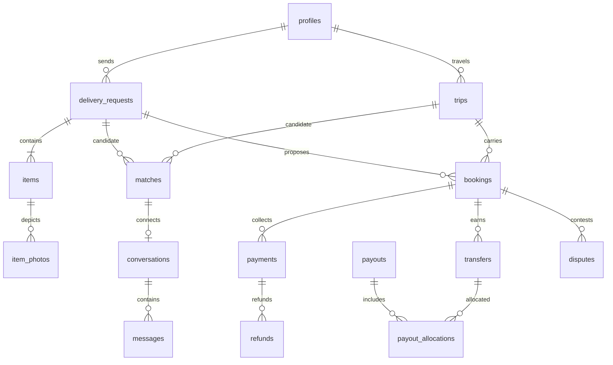

# Database model and access design

## Phase 1D implemented schema

`delivery_requests` owns the canonical route, flexible UTC window, lifecycle and optimistic version. `declared_items` is a one-to-one V1 declaration containing one stable category, exact integer measurements, content fields and handling metadata. `item_photos` authorizes pending/ready/deleted private Storage objects. Cancellations and append-only events are separate tables.

All account/location/category foreign keys use `ON DELETE RESTRICT`. Request, item, cancellation, photo and event foreign keys are indexed where they are not already covered by a unique/primary key. Checks enforce different locations, ordered windows no longer than 90 days, positive versions, valid state timestamps, 1–50,000 grams, all-or-none 1–2,000 mm dimensions, bounded quantity and trimmed content. See [delivery requests](delivery-requests.md).

## Phase 1C implemented schema

`item_categories` is active read-only reference data. `trips` owns the route, UTC instants, offered capacity, lifecycle and optimistic version. `trip_categories` normalizes accepted categories. `trip_cancellations` keeps the owner-only reason separate from discovery. `trip_events` is append-only from controlled commands.

Foreign keys to profiles, locations and categories use `ON DELETE RESTRICT` so future transactional history cannot be removed by cascading account or reference-data deletion. Indexed access paths cover owner history, published route/departure lookup, category lookup and ordered event history. Database checks enforce different endpoints, ordered timestamps, 1–50,000 grams, allowed lifecycle values and state timestamps. See [trips](trips.md) for commands, concurrency and visibility.

## Phase 1B implemented schema

`profiles` remains the private self-owned account record and adds legal names, E.164 phone, system-controlled `phone_verified_at` and `updated_at`. `member_profiles` is the narrow public card. `profile_trust` is a system-written projection. `locations` is the canonical read-only catalog; provider IDs are isolated in `private.location_provider_references`. `identity_verifications` stores versioned attempts and `identity_verification_events` their audit history. The public `avatars` bucket accepts only image MIME types up to 2 MiB and owner UUID paths.

Only verified phone numbers are unique, so an unverified number cannot be used to block its rightful owner. Location references use `ON DELETE SET NULL`; account-owned rows cascade from `profiles`. Indexed foreign keys cover residence and identity history lookup. Member profile changes use a security-invoker SQL command so private and public representations update atomically.

Status: [schema.sql](schema.sql) remains a reviewed future design reference. The migration directory contains the narrow Phase 1A/Auth-hardening and Phase 1B migrations with matching authorization tests. Future vertical slices remain undeployed until their owning phases add commands, RLS policies and tests.

## Conventions

PostgreSQL 17, UUID PKs, timestamptz, ISO country/currency codes; grams and millimeters as positive integers; money as bigint minor units. TypeScript converts database bigint safely with explicit bounds/string handling, never unchecked Number casts. Core records use RESTRICT deletion; retention/anonymization jobs preserve references. No cascading financial deletion. Versioned mutable aggregates use optimistic locking plus row locks. Timestamps/deadlines are database-owned. References to auth.users occur only at profiles; creating Auth users and profiles must recover idempotently across the auth/application boundary.

Public schema means API-exposable, not publicly readable. Every table has RLS enabled/forced and all anon/authenticated grants revoked in the reference. Private schema is not exposed via PostgREST. Sensitive records are returned through narrow authorized DTO commands, not blanket private-schema grants. FORCE RLS does not constrain superusers or BYPASSRLS service roles; this is why user requests never use them.

## Entity ownership and relationships

| Entity                                        | Owner / relations and purpose                                                                                |
| --------------------------------------------- | ------------------------------------------------------------------------------------------------------------ |
| countries, cities, item_categories            | Operator reference data; canonical route IDs, timezone, category registry                                    |
| profiles                                      | 1:1 auth.users, display name/locale only                                                                     |
| account_controls, profile_details             | 1:1 profile; authoritative restrictions/KYC projection and private contact/residence                         |
| staff_roles                                   | Staff profile + granting actor; revocable capability assignment                                              |
| trips, trip_categories                        | Traveler profile; ordered route times, capacity; category join                                               |
| delivery_requests                             | Sender profile; exact route and pickup/delivery windows, budget/currency                                     |
| items, item_photos                            | Request → items → photos; declaration, weight, dimensions, value; private storage references                 |
| matches                                       | Trip + request + algorithm version; input versions/reasons/expiry, advisory only                             |
| bookings                                      | Trip + request + sender/traveler/proposer; immutable accepted terms and fulfillment projection               |
| capacity_reservations                         | 1:1 booking hold lifecycle; trip and weight derived from booking                                             |
| booking_events, booking_contacts              | Append-only transition history; separate private handoff details                                             |
| conversations, conversation_members, messages | One conversation per match, optional booking link; exact participant membership; sender-scoped deduplication |
| payment_accounts                              | User + provider account + mode; provider capabilities independent from Flyco KYC                             |
| payments, payment_events                      | Booking has multiple historical collection attempts; at most one open/successful attempt                     |
| refunds                                       | Many per payment, partial refund audit trail                                                                 |
| transfers                                     | Booking/payment → traveler account, separate from bank payout                                                |
| payouts, payout_allocations                   | Provider bank payout; many transfers allocated to a batched payout                                           |
| ledger_entries                                | Immutable signed entries grouped into balanced per-currency journal                                          |
| reviews                                       | Completed booking + author + other participant; rating 1–5                                                   |
| reports                                       | Reporter + exactly one typed FK target (user/message/booking); no unvalidated polymorphic target             |
| disputes, provider_disputes                   | Marketplace booking case vs independent processor chargeback                                                 |
| case_assignments                              | Staff member assigned to report/dispute; scoped evidence access                                              |
| notifications                                 | Recipient only, content-free kind/resource reference, deduplication key                                      |
| identity_verifications                        | User + provider attempt, minimal status/reference, expiry/revocation                                         |
| delivery_confirmations, delivery_evidence     | Booking-owned hashed one-time challenges and private evidence references                                     |
| audit_events                                  | Append-only actor/action/resource/reason/correlation; no secret or message payloads                          |
| webhook_inbox, outbox_jobs                    | Durable provider events and side effects, unique keys, leases and retry metadata                             |
| idempotency_keys                              | Actor + operation + key + request hash/result reference/expiry                                               |
| user_blocks                                   | Blocking user controls; excludes unwanted matches/conversations                                              |

## Constraints and indexes

Schema reference supplies PKs/FKs/checks, composite FKs ensuring booking traveler owns trip and sender owns request, unique active booking per request, no self-booking, quote arithmetic, proposal uniqueness, one outstanding or successful collection per booking, one open dispute, one active identity attempt, provider IDs/idempotency/event uniqueness, bounded text and positive units. Index FK lookup columns, route/date discovery, message pagination, unread notifications, reservation expiry, ready jobs, audit subject/time and journal/currency. Maintain owner-leading indexes for RLS lookups; EXPLAIN realistic fixtures before launch. Currency exponent comes from a versioned supported-currency registry; V1 EUR proposal is not encoded as a permanent country assumption.

Not expressible as simple row CHECKs: capacity sum, request has at least one item, all categories/dimensions fit, participant membership matches a match/booking, review participants/completion, refund sums, balanced journals, payout allocation totals and state transitions. Enforce these in narrow transaction commands/triggers with locked parent rows and direct-column grants revoked. Reference SQL is deliberately NOT claimed to enforce them yet. Item/listing changes affecting an accepted booking are denied; immutable terms/contents snapshot prevents later edits from changing agreement. Reservation trip/weight are derived from its booking rather than duplicated. Transfer payment/booking/currency use a composite FK. Recipient/mode, conversation pairing and allocation totals still require transaction checks.

## RLS matrix for future feature migrations

No anon access by default. “Owner” always means `(select auth.uid())` derived from the actual parent FK. SELECT policy is required for permitted UPDATE; USING and WITH CHECK both preserve ownership. Mutation columns are separately allowlisted. Commands retain user JWT/RLS or use a narrowly reviewed privileged DB role for otherwise impossible transaction boundaries; no general service-role fallback.

| Table(s)                                               | SELECT scope                                                                                       | INSERT / UPDATE / DELETE strategy                                                                           |
| ------------------------------------------------------ | -------------------------------------------------------------------------------------------------- | ----------------------------------------------------------------------------------------------------------- |
| countries, cities, item_categories                     | Active reference data to members; safe anon lookup only if explicitly needed                       | Operator migration only                                                                                     |
| profiles                                               | Self; counterpart-safe display projection via authorized lookup                                    | Auth bootstrap; self may update display name/locale only; no client delete                                  |
| account_controls, profile_details                      | Self DTO; authorized assigned staff minimum                                                        | Private detail allowlist; controls only authorized moderation/provider commands                             |
| staff_roles                                            | Current staff's own capability DTO; administrator manages assignments                              | MFA audited privileged command; no self grant                                                               |
| trips                                                  | Owner; active discovery projection; booking counterpart on booked trip                             | Owner draft/listing commands; identities/status/capacity guarded; no delete with references                 |
| trip_categories                                        | Parent trip visibility                                                                             | Traveler only before commitments; FK ownership check                                                        |
| delivery_requests                                      | Owner; matched traveler safe projection; booked counterpart                                        | Sender only through commands; lock immutable terms after acceptance                                         |
| items, item_photos                                     | Sender; current matched/booked traveler approved projection; assigned case staff                   | Sender on editable request; clean scan required for counterpart; photo metadata server-derived              |
| matches                                                | Owning sender and traveler only                                                                    | Matcher/recompute command; no client writes                                                                 |
| bookings, booking_events                               | Exactly sender/traveler; assigned case staff projection                                            | Named commands; no direct status/participant writes; events append only                                     |
| capacity_reservations, booking_contacts                | Availability projection or booked participant contact DTO; no public raw reads                     | Booking command only; contact disclosure begins at approved booking stage                                   |
| conversations, conversation_members                    | Exact matched/booked participants; assigned report reviewer only                                   | Server derives two participants; no user-added membership; no recursive membership RLS                      |
| messages                                               | Active/historical authorized membership according to retention; assigned reported-message reviewer | Author is auth.uid, current membership and no block; dedupe; no author edit/delete; moderation hide command |
| payment_accounts                                       | User readiness DTO, finance support minimum                                                        | Provider/onboarding worker only                                                                             |
| payments, refunds, payment_events                      | Sender/traveler financial summary appropriate to role, scoped finance                              | Verified provider/finance commands only; no raw secrets or direct API grants                                |
| transfers, payouts, payout_allocations, ledger_entries | Traveler earnings DTO; authorized finance audit                                                    | Worker only; append-only ledger/reversal; no client writes                                                  |
| reviews                                                | Published safe review projection; author sees own pending review                                   | Participant on completed booking, subject is counterpart; one review; moderation action only                |
| reports                                                | Reporter sees own report/status only; assigned moderator sees case                                 | Authenticated submit command validates target visibility; status/staff notes not writable                   |
| disputes                                               | Booking participants see shared case projection; assigned operator                                 | Participant open command; operator resolves; internal notes private                                         |
| case_assignments, provider_disputes                    | Assigned staff/finance only, no general staff access                                               | Authorized assignment/provider command                                                                      |
| notifications                                          | user_id = auth.uid                                                                                 | Worker creates; recipient updates read_at only; retention job deletes                                       |
| identity_verifications                                 | User status DTO; assigned verification reviewer                                                    | Signed provider event/reviewer command; applicant cannot verify self                                        |
| delivery_confirmations                                 | No code_hash read API                                                                              | Participant handoff command; atomic attempts/consume                                                        |
| delivery_evidence                                      | Booking participants when justified and assigned case staff, via short-lived URL                   | Authorized uploader command; scan/retention controls                                                        |
| audit_events                                           | Auditors and case-scoped staff DTO; no public or unrestricted self payload                         | Internal append only; no update/delete except approved retention process                                    |
| webhook_inbox, outbox_jobs                             | Worker/operator health metadata only                                                               | Narrow worker role and lease procedures; no users                                                           |
| idempotency_keys                                       | Internal command scope by actor/operation                                                          | Atomic command only; TTL cleanup worker                                                                     |
| user_blocks                                            | Blocker only                                                                                       | Blocker create/delete; blocked user gets no list/identity leak                                              |

Staff helper design: avoid recursive RLS and spoofed context. Prefer private capability lookups through narrowly granted audited routines, fixed search_path, explicit auth.uid/session/MFA checks, non-login minimally privileged owner. Ordinary user commands use SECURITY INVOKER. SECURITY DEFINER, if unavoidable for protected lookups, requires separate review and negative tests.

## Storage / realtime

Planned private buckets: item-photos, delivery-evidence; identity-documents only if provider reference-only storage proves insufficient and privacy approval exists. Object paths include opaque owner/resource IDs, but policies join validated DB records. Owners cannot overwrite another resource or choose arbitrary owner metadata. Only clean scanned/decoded JPEG/PNG/WebP exposed; bound bytes/dimensions and remove EXIF. Do not grant public bucket access. Signed URLs default 60 seconds; credentials/URLs excluded from logs. Cleanup must handle orphan uploads and tombstones safely.

Realtime starts with messages and notification hints only. Private channels authorize participant membership; a forged topic cannot grant access. Durable database is source of truth, reconnect reads missed IDs. Do not publish private financial/KYC/audit tables. Revocation/blocking must reauthorize/disconnect subscriptions; test unauthorized subscription separately from REST RLS.

## Migration/recovery strategy

Create migration with pinned Supabase CLI; use local stack, review generated diff, run pgTAP/negative RLS and reset tests, then staging. Small expand/backfill/validate/contract migrations, lock timeouts, concurrent index strategy for large live tables, no rewriting deployed history. Production migration credentials separate from runtime; manual protected environment approval and backup/restore rehearsal required. Record SQL hash/commit, duration and operator. Never restore production data into preview. See deployment.md.

## Review clarifications: privileges, normalization and scope

RLS restricts rows, not columns. A safe Next.js DTO does not restrict direct PostgREST queries. Never grant counterpart SELECT on all columns of items, requests, bookings or profiles to implement discovery. Use explicit column grants for genuinely shared fields; put owner-only columns in private tables when scopes differ. Invoker views require underlying privileges and do not hide columns that remain directly granted. Views must use `security_invoker = true`; a reviewed, minimally privileged projection routine is needed when base-table privileges cannot safely be granted. Test `select *`, joins and direct REST reads as a stranger and counterpart.

A SECURITY INVOKER command cannot write columns its caller is forbidden to write. For protected multi-table mutations, use an explicit invoker RPC wrapper calling a private SECURITY DEFINER routine owned by a dedicated NOLOGIN NOBYPASSRLS role, not postgres/service_role. Revoke default PUBLIC EXECUTE, grant only the specific wrapper/private entry point needed, fix search_path, schema-qualify names and give the owner explicit table privileges and RLS policies. The caller remains authenticated by JWT; the routine checks auth.uid, current restrictions, participants and command guards. Assume callers can invoke the entry point directly. No client-set custom GUC is an authorization credential. Each feature migration must prove this boundary with direct-call and direct-table negative tests; no such routines exist in Phase 0.

Profiles reference Auth with RESTRICT deliberately: implement closure/anonymization and retained-record handling before hard deletion; do not casually switch to CASCADE for financial participants. City identity is UUID, not (country,name): multiple cities in a country may share a name. Canonical data import must resolve duplicates using the chosen gazetteer and subdivision, without a name uniqueness constraint. Item declared value inherits request currency; acceptance snapshots it and prevents currency/item changes. Booking participant/weight and payment relationships are deliberate immutable snapshots, not independently editable duplicate data. Verification state in account_controls is a transactional projection of the latest eligible provider attempt, never a second authority.

Index review removed standalone indexes already covered by the leading columns of full PK/unique/cursor indexes; partial indexes cannot replace general FK lookups. Added booking parent lookups, proposal deadlines, idempotency expiry and crashed-worker lease recovery indexes. The pgTAP reference checks assert FK index coverage. Measure plans with real query shapes when features exist; do not add speculative indexes to every field.

All 42 tables remain a future-domain map, not a Phase 1 migration plan. Phase 1A needs profiles and account_controls plus narrowly necessary authorization/audit support. Introduce queues, ledger, payouts and case tables only with their owning phases. No event-sourcing framework: tables hold current state, events record audit history.

Capacity reservations contain only booking ID and hold lifecycle. Join to the immutable booking for trip/weight when summing capacity; acceptance and expiry both lock that trip. This removes redundant fields, a second weight authority and an unnecessary index.

## Phase 1A applied slice

`public.profiles(id → auth.users.id ON DELETE CASCADE, display_name, locale, account_status, created_at)` is the only migrated business table. `id` is both PK and FK; no redundant index is needed. `account_status` has a partial index for non-active operational lookups. Name, locale and status have CHECK constraints. RLS is enabled. `authenticated` has self SELECT; INSERT on id/display_name/locale only; UPDATE on display_name/locale only. Self INSERT requires active default, self UPDATE requires active old/new status. No member DELETE, owner transfer, or status write. `anon` has no table grant. Server identity checks require verified email and a fresh `getUser()` response; account status comes from the current DB row. pgTAP and direct local Data API tests cover owner, cross-user and anonymous access. Future public counterpart projections must use separate reviewed policies/DTOs.

The reference `private.account_controls` has **not** been migrated: a single non-sensitive account status in `profiles` is sufficient for this slice and avoids a speculative privileged function or extra table. When staff moderation begins, migrate controls with an explicit transition/audit plan before enabling staff mutations.
