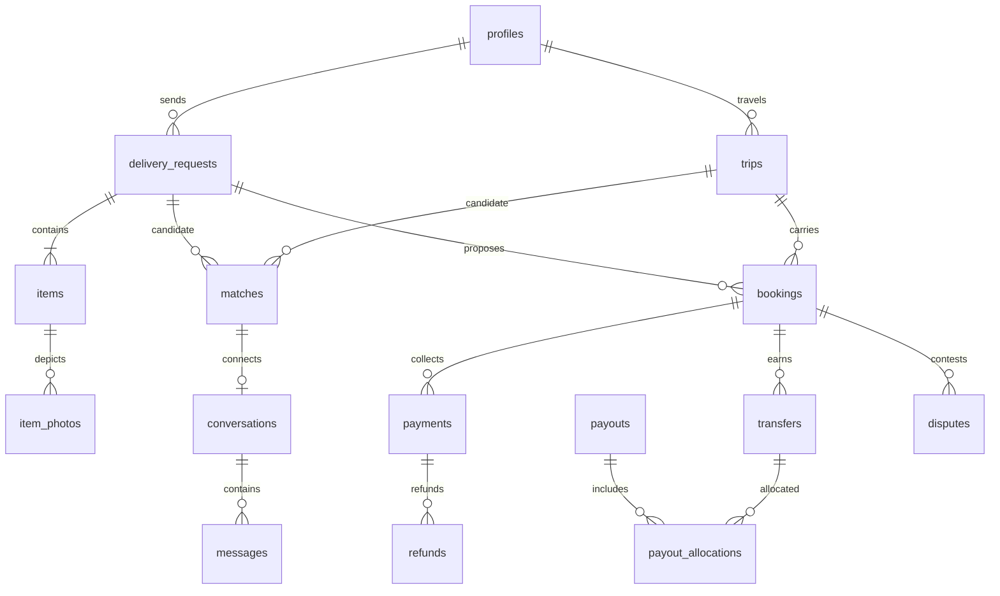

# Database model and access design

Status: reviewed design reference in [schema.sql](schema.sql), not a deployed product schema. The current migration directory remains product-empty. This prevents deploying table APIs without their authorization, transitions and tests. Promote vertical slices into versioned migrations during subsequent phases. No shared database was changed for schema design.

## Conventions

PostgreSQL 17, UUID PKs, timestamptz, ISO country/currency codes; grams and millimeters as positive integers; money as bigint minor units. TypeScript converts database bigint safely with explicit bounds/string handling, never unchecked Number casts. Core records use RESTRICT deletion; retention/anonymization jobs preserve references. No cascading financial deletion. Versioned mutable aggregates use optimistic locking plus row locks. Timestamps/deadlines are database-owned. References to auth.users occur only at profiles; creating Auth users and profiles must recover idempotently across the auth/application boundary.

Public schema means API-exposable, not publicly readable. Every table has RLS enabled/forced and all anon/authenticated grants revoked in the reference. Private schema is not exposed via PostgREST. Sensitive records are returned through narrow authorized DTO commands, not blanket private-schema grants. FORCE RLS does not constrain superusers or BYPASSRLS service roles; this is why user requests never use them.

## Entity ownership and relationships

| Entity                                        | Owner / relations and purpose                                                                                |
| --------------------------------------------- | ------------------------------------------------------------------------------------------------------------ |
| countries, cities, item_categories            | Operator reference data; canonical route IDs, timezone, category registry                                    |
| profiles                                      | 1:1 auth.users, display name/locale only                                                                     |
| account_controls, profile_details             | 1:1 profile; authoritative restrictions/KYC projection and private contact/residence                         |
| staff_roles                                   | Staff profile + granting actor; revocable capability assignment                                              |
| trips, trip_categories                        | Traveler profile; ordered route times, capacity; category join                                               |
| delivery_requests                             | Sender profile; exact route and pickup/delivery windows, budget/currency                                     |
| items, item_photos                            | Request → items → photos; declaration, weight, dimensions, value; private storage references                 |
| matches                                       | Trip + request + algorithm version; input versions/reasons/expiry, advisory only                             |
| bookings                                      | Trip + request + sender/traveler/proposer; immutable accepted terms and fulfillment projection               |
| capacity_reservations                         | 1:1 booking + trip, held/committed/released capacity with expiry                                             |
| booking_events, booking_contacts              | Append-only transition history; separate private handoff details                                             |
| conversations, conversation_members, messages | One conversation per match, optional booking link; exact participant membership; sender-scoped deduplication |
| payment_accounts                              | User + provider account + mode; provider capabilities independent from Flyco KYC                             |
| payments, payment_events                      | Booking has multiple historical collection attempts; at most one open/successful attempt                     |
| refunds                                       | Many per payment, partial refund audit trail                                                                 |
| transfers                                     | Booking/payment → traveler account, separate from bank payout                                                |
| payouts, payout_allocations                   | Provider bank payout; many transfers allocated to a batched payout                                           |
| ledger_entries                                | Immutable signed entries grouped into balanced per-currency journal                                          |
| reviews                                       | Completed booking + author + other participant; rating 1–5                                                   |
| reports                                       | Reporter + exactly one typed FK target (user/message/booking); no unvalidated polymorphic target             |
| disputes, provider_disputes                   | Marketplace booking case vs independent processor chargeback                                                 |
| case_assignments                              | Staff member assigned to report/dispute; scoped evidence access                                              |
| notifications                                 | Recipient only, content-free kind/resource reference, deduplication key                                      |
| identity_verifications                        | User + provider attempt, minimal status/reference, expiry/revocation                                         |
| delivery_confirmations, delivery_evidence     | Booking-owned hashed one-time challenges and private evidence references                                     |
| audit_events                                  | Append-only actor/action/resource/reason/correlation; no secret or message payloads                          |
| webhook_inbox, outbox_jobs                    | Durable provider events and side effects, unique keys, leases and retry metadata                             |
| idempotency_keys                              | Actor + operation + key + request hash/result reference/expiry                                               |
| user_blocks                                   | Blocking user controls; excludes unwanted matches/conversations                                              |

## Constraints and indexes

Schema reference supplies PKs/FKs/checks, composite FKs ensuring booking traveler owns trip and sender owns request, unique active booking per request, no self-booking, quote arithmetic, proposal uniqueness, one nonfailed payment, one open dispute, one active identity attempt, provider IDs/idempotency/event uniqueness, bounded text and positive units. Index FK lookup columns, route/date discovery, message pagination, unread notifications, reservation expiry, ready jobs, audit subject/time and journal/currency. Maintain owner-leading indexes for RLS lookups; EXPLAIN realistic fixtures before launch. Currency exponent comes from a versioned supported-currency registry; V1 EUR proposal is not encoded as a permanent country assumption.

Not expressible as simple row CHECKs: capacity sum, request has at least one item, all categories/dimensions fit, participant membership matches a match/booking, review participants/completion, refund sums, balanced journals, payout allocation totals and state transitions. Enforce these in narrow transaction commands/triggers with locked parent rows and direct-column grants revoked. Reference SQL is deliberately NOT claimed to enforce them yet. Item/listing changes affecting an accepted booking are denied; immutable terms/contents snapshot prevents later edits from changing agreement. Cross-table IDs in reservation, transfer, conversation and allocations must be checked in the command transaction.

## RLS matrix for future feature migrations

No anon access by default. “Owner” always means `(select auth.uid())` derived from the actual parent FK. SELECT policy is required for permitted UPDATE; USING and WITH CHECK both preserve ownership. Mutation columns are separately allowlisted. Commands retain user JWT/RLS or use a narrowly reviewed privileged DB role for otherwise impossible transaction boundaries; no general service-role fallback.

| Table(s)                                               | SELECT scope                                                                                       | INSERT / UPDATE / DELETE strategy                                                                           |
| ------------------------------------------------------ | -------------------------------------------------------------------------------------------------- | ----------------------------------------------------------------------------------------------------------- |
| countries, cities, item_categories                     | Active reference data to members; safe anon lookup only if explicitly needed                       | Operator migration only                                                                                     |
| profiles                                               | Self; counterpart-safe display projection via authorized lookup                                    | Auth bootstrap; self may update display name/locale only; no client delete                                  |
| account_controls, profile_details                      | Self DTO; authorized assigned staff minimum                                                        | Private detail allowlist; controls only authorized moderation/provider commands                             |
| staff_roles                                            | Current staff's own capability DTO; administrator manages assignments                              | MFA audited privileged command; no self grant                                                               |
| trips                                                  | Owner; active discovery projection; booking counterpart on booked trip                             | Owner draft/listing commands; identities/status/capacity guarded; no delete with references                 |
| trip_categories                                        | Parent trip visibility                                                                             | Traveler only before commitments; FK ownership check                                                        |
| delivery_requests                                      | Owner; matched traveler safe projection; booked counterpart                                        | Sender only through commands; lock immutable terms after acceptance                                         |
| items, item_photos                                     | Sender; current matched/booked traveler approved projection; assigned case staff                   | Sender on editable request; clean scan required for counterpart; photo metadata server-derived              |
| matches                                                | Owning sender and traveler only                                                                    | Matcher/recompute command; no client writes                                                                 |
| bookings, booking_events                               | Exactly sender/traveler; assigned case staff projection                                            | Named commands; no direct status/participant writes; events append only                                     |
| capacity_reservations, booking_contacts                | Availability projection or booked participant contact DTO; no public raw reads                     | Booking command only; contact disclosure begins at approved booking stage                                   |
| conversations, conversation_members                    | Exact matched/booked participants; assigned report reviewer only                                   | Server derives two participants; no user-added membership; no recursive membership RLS                      |
| messages                                               | Active/historical authorized membership according to retention; assigned reported-message reviewer | Author is auth.uid, current membership and no block; dedupe; no author edit/delete; moderation hide command |
| payment_accounts                                       | User readiness DTO, finance support minimum                                                        | Provider/onboarding worker only                                                                             |
| payments, refunds, payment_events                      | Sender/traveler financial summary appropriate to role, scoped finance                              | Verified provider/finance commands only; no raw secrets or direct API grants                                |
| transfers, payouts, payout_allocations, ledger_entries | Traveler earnings DTO; authorized finance audit                                                    | Worker only; append-only ledger/reversal; no client writes                                                  |
| reviews                                                | Published safe review projection; author sees own pending review                                   | Participant on completed booking, subject is counterpart; one review; moderation action only                |
| reports                                                | Reporter sees own report/status only; assigned moderator sees case                                 | Authenticated submit command validates target visibility; status/staff notes not writable                   |
| disputes                                               | Booking participants see shared case projection; assigned operator                                 | Participant open command; operator resolves; internal notes private                                         |
| case_assignments, provider_disputes                    | Assigned staff/finance only, no general staff access                                               | Authorized assignment/provider command                                                                      |
| notifications                                          | user_id = auth.uid                                                                                 | Worker creates; recipient updates read_at only; retention job deletes                                       |
| identity_verifications                                 | User status DTO; assigned verification reviewer                                                    | Signed provider event/reviewer command; applicant cannot verify self                                        |
| delivery_confirmations                                 | No code_hash read API                                                                              | Participant handoff command; atomic attempts/consume                                                        |
| delivery_evidence                                      | Booking participants when justified and assigned case staff, via short-lived URL                   | Authorized uploader command; scan/retention controls                                                        |
| audit_events                                           | Auditors and case-scoped staff DTO; no public or unrestricted self payload                         | Internal append only; no update/delete except approved retention process                                    |
| webhook_inbox, outbox_jobs                             | Worker/operator health metadata only                                                               | Narrow worker role and lease procedures; no users                                                           |
| idempotency_keys                                       | Internal command scope by actor/operation                                                          | Atomic command only; TTL cleanup worker                                                                     |
| user_blocks                                            | Blocker only                                                                                       | Blocker create/delete; blocked user gets no list/identity leak                                              |

Staff helper design: avoid recursive RLS and spoofed context. Prefer private capability lookups through narrowly granted audited routines, fixed search_path, explicit auth.uid/session/MFA checks, non-login minimally privileged owner. Ordinary user commands use SECURITY INVOKER. SECURITY DEFINER, if unavoidable for protected lookups, requires separate review and negative tests.

## Storage / realtime

Planned private buckets: item-photos, delivery-evidence; identity-documents only if provider reference-only storage proves insufficient and privacy approval exists. Object paths include opaque owner/resource IDs, but policies join validated DB records. Owners cannot overwrite another resource or choose arbitrary owner metadata. Only clean scanned/decoded JPEG/PNG/WebP exposed; bound bytes/dimensions and remove EXIF. Do not grant public bucket access. Signed URLs default 60 seconds; credentials/URLs excluded from logs. Cleanup must handle orphan uploads and tombstones safely.

Realtime starts with messages and notification hints only. Private channels authorize participant membership; a forged topic cannot grant access. Durable database is source of truth, reconnect reads missed IDs. Do not publish private financial/KYC/audit tables. Revocation/blocking must reauthorize/disconnect subscriptions; test unauthorized subscription separately from REST RLS.

## Migration/recovery strategy

Create migration with pinned Supabase CLI; use local stack, review generated diff, run pgTAP/negative RLS and reset tests, then staging. Small expand/backfill/validate/contract migrations, lock timeouts, concurrent index strategy for large live tables, no rewriting deployed history. Production migration credentials separate from runtime; manual protected environment approval and backup/restore rehearsal required. Record SQL hash/commit, duration and operator. Never restore production data into preview. See deployment.md.
